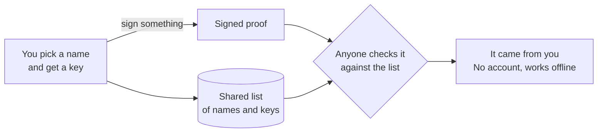

# Vouch

**ID you carry, not ID they control.** Vouch is a self-owned alternative to
government digital ID. You prove it's you with a key you hold, not a record
someone else keeps.

## What it is

You pick a name, like `@adam`. Vouch makes a secret key that stays on your
computer, and adds your name and the key's public half to a shared list: a
plain folder of files you can publish for anyone to copy. Anything you sign
with your key can then be checked against that list by anyone, even offline,
with no account and no company in the middle.



## Try it

```bash
pip install https://github.com/ao3575911/vouch-id/releases/download/v0.3.1/vouch_id-0.3.1-py3-none-any.whl
vouch-id get @adam     # claim your name and make your key
vouch-id card @adam    # make a printable card signed with your key
vouch-id audit         # check that nothing in the list was tampered with
```

Pick your own name instead of `@adam`. Your key is saved in `~/.didhome`.
Keep it private.

## What it isn't

A proof shows that something was signed by the key behind a name. Nobody
checks what you sign, so Vouch can't prove your age or legal name, and it
doesn't replace government ID.

[Docs](https://ao3575911.github.io/vouch-id/) · [Security](https://github.com/ao3575911/vouch-id/blob/main/SECURITY.md) · [Contributing](https://github.com/ao3575911/vouch-id/blob/main/CONTRIBUTING.md) · [Licence](https://github.com/ao3575911/vouch-id/blob/main/LICENSE)
