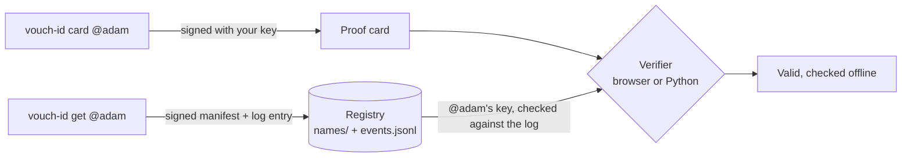
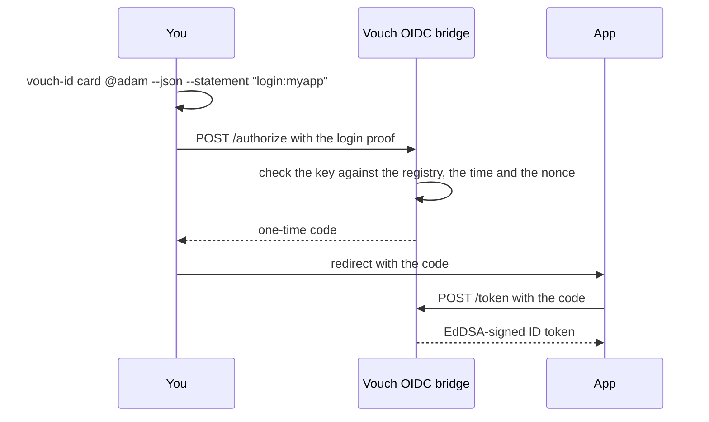

# Vouch

**ID you carry, not ID they control.** Vouch is a self-owned alternative to
government digital ID for logging in and signing things: a name you claim
yourself, a key only you hold, and proofs anyone can check offline.

No account, no email, no phone number. A proof shows that a statement was
signed by the key behind your name. It doesn't prove your age or legal name,
because nobody vouches for what you sign.





## Quick start

```bash
# 1. install
pip install https://github.com/ao3575911/vouch-id/releases/download/v0.3.1/vouch_id-0.3.1-py3-none-any.whl
# 2. claim your name and make your key
vouch-id get @adam
# 3. sign a proof card anyone can check
vouch-id card @adam --out card.html
```

It's not on PyPI yet, so this installs the wheel from the
[v0.3.1 release](https://github.com/ao3575911/vouch-id/releases/tag/v0.3.1).

`vouch-id audit` re-checks the whole registry offline and prints
`registry OK: 1 handles, 1 events, chain verified`.

## How it works

- `get` makes an Ed25519 key in `~/.didhome` and writes a self-signed manifest plus a signed entry in a hash-chained log to `./registry`, a plain folder meant to be a public git repo anyone can mirror or fork.
- A verifier pins a proof to the key in your manifest and checks that key against the log. Nothing is called and nothing is logged.
- Lose your key and the guardians you named beforehand can approve a new one.
- `python -m vouch.oidc` runs a small OpenID Connect bridge that swaps a login proof for an ID token. It's a reference implementation and hasn't been tested with real apps yet.

[Docs](https://ao3575911.github.io/vouch-id/) · [Security](https://github.com/ao3575911/vouch-id/blob/main/SECURITY.md) · [Contributing](https://github.com/ao3575911/vouch-id/blob/main/CONTRIBUTING.md) · [Licence](https://github.com/ao3575911/vouch-id/blob/main/LICENSE)
