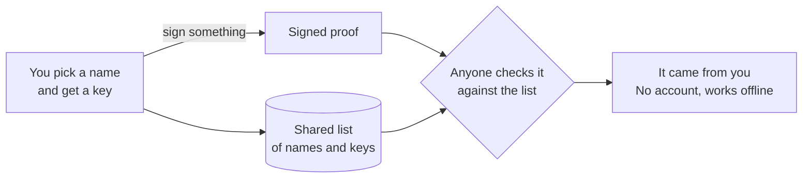

# Vouch

**ID you carry, not ID they control.** Vouch is a self-owned alternative to
government digital ID. You prove it's you with a key you hold, not a record
someone else keeps.

## What it is

You pick a name, like `@adam`. Vouch makes a secret key that stays on your
computer, and adds your name and the key's public half to a shared list: a
plain folder of files you can publish for anyone to copy. Anything you sign
with your key can then be checked against that list by anyone, even offline,
with no account and no company in the middle.



## Try it

```bash
pip install https://github.com/ao3575911/vouch-id/releases/download/v0.4.0/vouch_id-0.4.0-py3-none-any.whl
vouch-id get @adam     # claim your name and make your key
vouch-id card @adam    # make a printable card signed with your key
vouch-id audit         # check that nothing in the list was tampered with
vouch-id vouch @sam --over 18 --method in-person   # vouch for someone; they `prove`, you `check`
```

Pick your own name instead of `@adam`. Your key is saved in `~/.didhome`.
Keep it private.

## How it proves your age and name

The people and businesses who already check ID, like a pharmacy, a notary,
a bank or someone who has known you for years, **vouch** for you. A vouch is
a signed claim such as "over 18" or "full name is Adam Smith", made with the
voucher's own key and tied to yours. It says how they checked
(`saw-passport`, `in-person`) and can expire or be withdrawn.

When a shop or site asks, you prove only what it needs. "Over 18" shows
that, not your birthdate. Your proof is signed fresh for that verifier, so a
copy is useless to anyone else. The verifier checks it against the public
list, even offline, and decides whose vouches it trusts and how many it
wants. There's no central database and no record of where you used it.

It is a plan B to government digital ID, not legally recognised ID, and a
vouch is only as good as the person who made it. [How vouches work](https://ao3575911.github.io/vouch-id/attestations.html).

[Docs](https://ao3575911.github.io/vouch-id/) · [Security](https://github.com/ao3575911/vouch-id/blob/main/SECURITY.md) · [Contributing](https://github.com/ao3575911/vouch-id/blob/main/CONTRIBUTING.md) · [Licence](https://github.com/ao3575911/vouch-id/blob/main/LICENSE)
