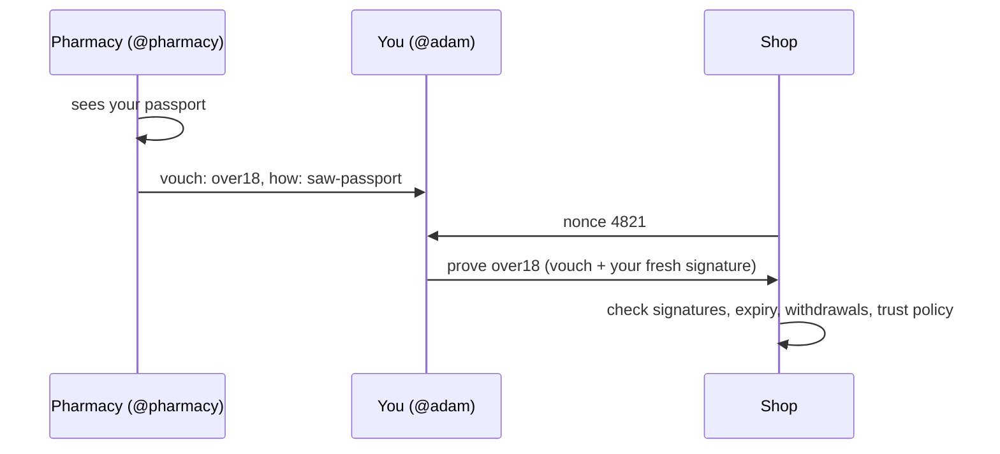

# Proving age and name (vouches)

Government ID works because someone trusted checked you once and signed for
it. Vouch does the same thing without the central database: people and
businesses who already check ID (a pharmacy, a notary, a bank, someone who
has known you for years) **vouch** for you. Each vouch is a signed claim about
your name, like "over 18" or "full name is Adam Smith", made with the
voucher's own key.

You keep your vouches. When a shop or website asks, you **prove** just the
claim they need, signed fresh for them. They **check** it against the public
registry, offline, and decide whose vouches they trust. Nobody is called and
nothing is logged.



## Vouch for someone

```bash
vouch-id vouch @adam --over 18 --method saw-passport --expires 5y
vouch-id vouch @adam --name "Adam Smith" --method saw-passport
vouch-id vouch @adam --claim member=riverside-club --method in-person
```

- `--method` is required: say how you checked (`saw-passport`, `in-person`,
  `known-5-years`). Verifiers see it.
- `--over AGE` is repeatable. `--birthdate YYYY-MM-DD` works out which of
  over13, over16, over18 and over21 apply. The birthdate itself is never
  written anywhere, not in the vouch and not on disk.
- Each claim becomes its own vouch, so the holder can show one without the
  others.
- `--as @you` picks your handle if your keystore holds more than one.
- It writes `adam.vouch.json` (or `--out FILE`). Give that file to the person.

To withdraw a vouch: `vouch-id unvouch <id>`. This adds a signed event to the
registry log, and verifiers stop counting it.

## Keep and prove

```bash
vouch-id keep @adam adam.vouch.json                  # checks, then stores in ~/.didhome/vouches/adam
vouch-id prove @adam --show over18 --audience shop.example --nonce 4821 --out proof.json
```

A presentation holds only the vouches for what you chose to show (for age,
the lowest threshold that answers the question), plus a fresh signature by
your key over the audience, the nonce and the time. It's valid for five
minutes.

## Check

```bash
vouch-id check proof.json --audience shop.example --nonce 4821 --trust @pharmacy,@notary --min 1
```

```
presentation from @adam, signed by their current key
over18: yes  [OK: 1 of 1 needed]
  vouched by @pharmacy (saw-passport, 2026-10-04, until 2031-10-03)
```

`check` verifies the holder's signature against the registry, the audience,
the nonce and the age of the presentation, then each vouch: the voucher's
current key signed it, it is about this holder's key, it hasn't expired and
the voucher hasn't withdrawn it. Your policy decides the rest:

- `--trust @a,@b` counts only vouchers you trust.
- `--min N` needs N different vouchers to agree on each claim.

It exits non-zero if any shown claim falls short.

The browser verifier ([verify.html](verify.html)) checks presentations too.
Give it a registry URL and it fetches the manifests and the withdrawals;
paste manifests instead and it works offline but can't see withdrawals.

## Why it holds up

- **Bound to you.** A vouch names your handle and key. Someone who copies it
  can't present it, because the presentation must be signed by your key.
- **No replay.** The verifier's nonce and audience are inside your
  signature, and presentations expire after five minutes.
- **Withdrawable.** Vouchers revoke through the public event log.
- **Survives recovery.** If you recover your name with guardians, vouches
  made for your old key still count. If a voucher recovers theirs, vouches
  signed with their old key stop counting, so a thief's vouches die with the
  stolen key.
- **Your choice of who to trust.** There's no central list of approved
  vouchers. Each verifier sets its own policy.

## Limits

- A vouch is as good as the voucher. A verifier that trusts anyone will
  accept anyone's vouches; use `--trust` and `--min`.
- Presentations show your handle. Proving "over 18" without revealing who you
  are needs unlinkable proofs, which are planned (issue #39).
- This is not legally recognised ID. Whether a business can accept it is up
  to the business and local law.

Background: [ADR 0002](adr-0002-attestations.md).
