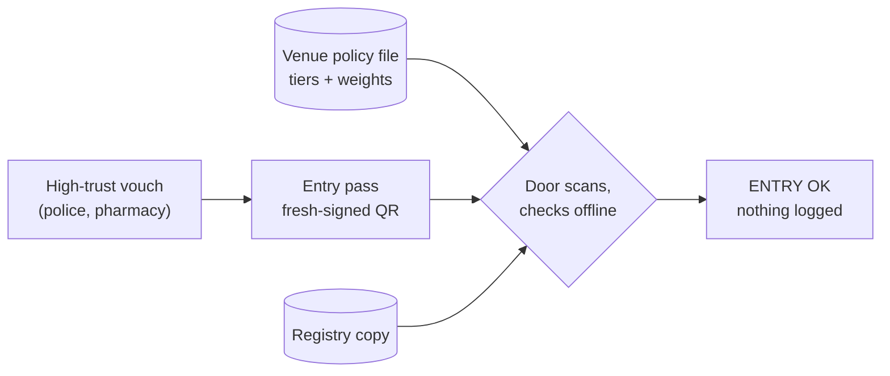

# Venue entry: QR passes checked at the door

A venue — a bar, a bottle shop, a licensed premises — checks "over 18" at
the door without seeing a birthdate, calling anyone or keeping a record.
The venue writes one policy file; the patron shows a short-lived QR pass;
the door checks it against its own copy of the public registry, offline.



## 1. The venue writes a policy

One JSON file, kept by the venue. It says which claims the door needs,
which vouchers the venue trusts, and how much weight each class of voucher
carries. Weighting is the venue's call — there is no central score.

```json
{
  "type": "vouch-venue-policy",
  "v": 1,
  "venue": "bottleshop.perth.example",
  "require": ["over18"],
  "tiers": { "police": 3, "licensed": 2, "peer": 1 },
  "vouchers": {
    "wa-police-perth": "police",
    "pharmacy-subiaco": "licensed",
    "sam": "peer"
  },
  "min_weight": 2,
  "max_age": 120
}
```

Fail-closed rules: a voucher the policy does not list counts for nothing, a
tier the policy does not define is an error, and a claim below `min_weight`
denies entry. A full example is in
[`examples/venue-policy.json`](https://github.com/ao3575911/vouch-id/blob/main/examples/venue-policy.json).

## 2. The patron mints an entry pass

The door shows a code (the nonce). The patron turns a heavy vouch they
already hold — a pharmacist or an officer who saw their passport — into a
pass for this venue only:

```bash
vouch-id entry @adam --venue bottleshop.perth.example --nonce 77
```

This writes `adam.pass.json` and `adam.pass.html` — a one-screen QR page
(install `vouch-id[qr]` for the QR image). The pass is a presentation:
fresh-signed by the patron's key, bound to the venue's id and the door's
nonce, and stale after `max_age` seconds. A copy is useless at any other
venue, with any other nonce, or later.

## 3. The door checks it

```bash
vouch-id door adam.pass.json --policy venue.json --nonce 77
```

```
pass from @adam for bottleshop.perth.example
over18: weight 2 of 2 needed  [OK]
  @pharmacy-subiaco (licensed, weight 2, saw-passport)
ENTRY OK
```

The check runs against the venue's local registry copy: signatures, expiry,
revocation, the venue and nonce binding, then the policy — summing the tier
weights of distinct trusted vouchers behind each required claim. Nobody is
called; nothing is logged. The door sees "over 18", never a birthdate.

## Roadmap (not built yet)

- *Scanner PWA:* the browser verifier wrapped as an installable
  offline-capable scanner for door staff, reading the pass QR with the
  camera and the venue policy from a local file.
- *Wallet app:* mobile and desktop app holding the key and kept vouches,
  presenting and scanning QR passes; the key never leaves the device, and
  recovery uses the existing [guardian flow](recovery.md).
- *Voucher onboarding:* signed organisation manifests for high-trust
  vouchers (pharmacies, police stations) in the registry, with an in-person
  saw-passport workflow.
- *Gamification:* streaks, voucher reputation and badges computed
  client-side from public registry events only — no tracking, no central
  database.
- *Scale:* registry sharding by handle prefix and mirroring for metro
  scale, then per-city registry federation with cross-city voucher-tier
  recognition.
